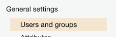
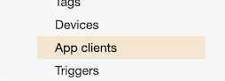
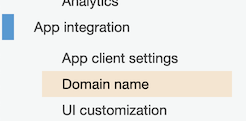
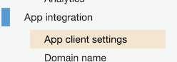
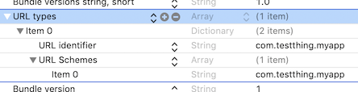

# Capacitor Test

So this is my attempt to get Capacitor working with some of the critical requirements my current (other) project has.

## Setup

I'm using a personal setup of Cognito.  Using a created user within Cognito and setup a login page.

### Creating the Cognito bits

You need to have an AWS account and navigate to the Cognito page within the console.

https://us-east-2.console.aws.amazon.com/cognito/home?region=us-east-2

1. Click "manage user pools" and "create user pool".
2. Name the pool whatever you want.
3. Click "Review Defaults", we are fine with defaults for this case
4. Click "Create Pool"
5. Now that the pool is created, click "Users and groups" link to add a new user
    * 
5. Create a user for yourself, note the phone needs to be `+1....`
6. Now we need to create a login page, click "App Clients" in the menu
    * 
7. Click "Add App Client"
8. Create a name for the app client
9. Uncheck the "create app secret"
10. Click save
11. Now we need to give that app client a domain to live on, click "Domain Name"
    * 
12. Make up a domain name and hit save
13. Lastly we need to tell it what the valid domains and callback urls are, navigate to "App Client Settings"
    * 
14. Create domains for the signin and signout that you plan to use in the app, something like:
    * `com.testthing.myapp://signin`
    * `com.testthing.myapp://signout`
15. Check the Implicit Grant and Authorization code grant
16. Check the `email` and `openid` scopes
17. Click save!  We are finally ready to go!

### Setting up this project

1. Run `yarn`
2. Copy the `.env-example` file named `.env`
3. Edit the new `.env` file to correspond with the values we put into AWS
    * The only one that's a little odd is the `APP_DOMAIN`, it's just used for the web so it's not critical to fill in
4. Run `yarn build`
5. Run `yarn cap open ios`
6. Edit the `Info.plist` file in XCode
    * Update the URL Types to match what we put in AWS
    * 
7. Start the app!

## The tests (and Issues)

One issue resolved: https://stackoverflow.com/questions/54611808/awscognito-auth-getsession-does-not-fire-callback-in-swift